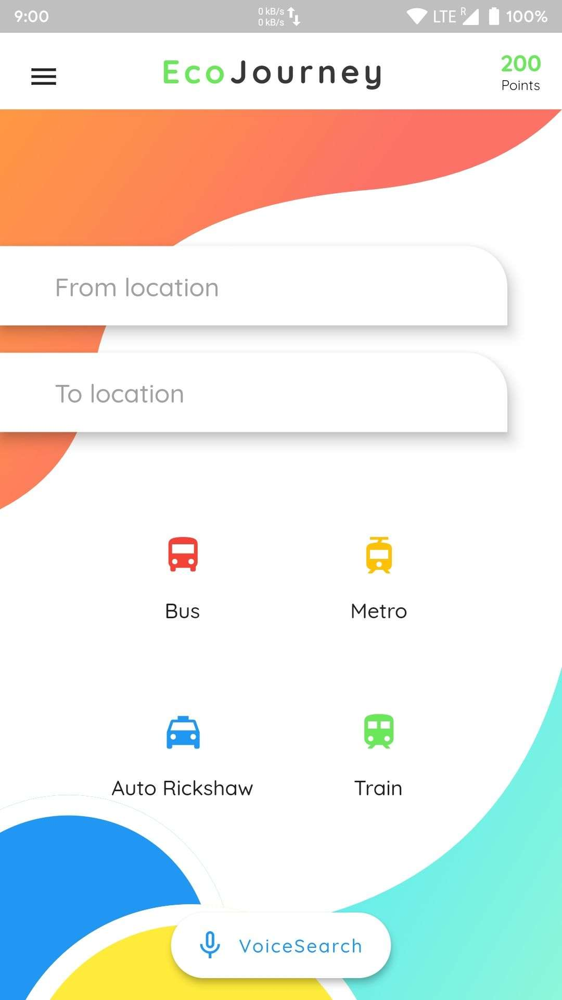
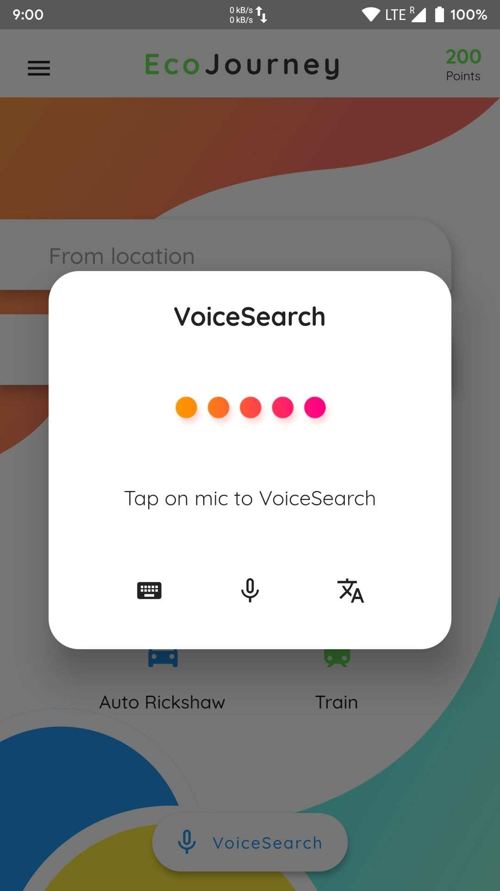

</p>
<p align="center">
  <strong>EcoTrip Abu Dhabi</strong> is an AI-powered sustainable tourism platform that offers personalized itineraries, promotes eco-friendly travel, and showcases Abu Dhabi's cultural and natural heritage. It seamlessly integrates open data to enhance the tourist experience while supporting Abu Dhabi's Vision 2030 goals of sustainability and cultural preservation.
</p>
<p align="center">
  Show some love 💜 and Star ⭐️ the Repository to support the project.
</p>

|                     Interactive Map                     |                     AI ChatBot                      |                   Gamification                     |
|:-------------------------------------------------------:|:--------------------------------------------------:|:-------------------------------------------------:|
|        |   |  |
|       **Cultural Highlights**                          |       **Sustainability Insights**                  |          **Rewards and Progress Tracking**        |

---

## What’s In This Document

- [Features](#sparkles-features)
- [How It Works](#gear-how-it-works)
- [Get Up and Running in 5 Minutes](#rocket-get-up-and-running-in-5-minutes)
- [Technologies and Packages Used](#ballot_box-technologies-and-packages-used)
- [Versioning](#label-versioning)
- [Queries / Bugs](#question-queries--bugs)
- [License](#memo-license)
- [Thanks to Contributors and Sponsors](#purple_heart-thanks)

---

## :sparkles: Features

- **Interactive Eco-Tourism Map**: Access real-time data on eco-friendly attractions, accommodations, dining, and cultural sites.  
- **AI-Powered Personalized ChatBot**: Get curated travel itineraries tailored to your preferences, time, and budget.  
- **Multilingual Support**: Offers seamless interactions for diverse global travelers.  
- **Sustainability Metrics**: Real-time air quality, crowd density, and eco-impact analysis.  
- **Gamification**: Earn points for eco-friendly choices and redeem them for rewards.  
- **Educational Insights**: Learn about Abu Dhabi’s history, culture, and sustainability efforts.  
- **Emergency Assistance**: Instant help for travel-related issues, like reporting lost items or accessing local authorities.

---

## :gear: How It Works

1. **User Interaction**: Engage via voice or text commands through the app or website.  
2. **AI Processing**: The platform uses NLP and open data APIs to provide accurate, up-to-date responses.  
3. **Adaptive Learning**: Learns from user behavior to enhance future recommendations.  
4. **Context Awareness**: Adjusts recommendations based on your location, time, and preferences.  

---

## :rocket: Get Up and Running in 5 Minutes

1. **Install the Flutter SDK & Android Studio.** [Instructions](https://medium.com/enappd/install-flutter-on-windows-and-mac-1fd1dde453ba).  
2. **Clone the repository.**  
   ```shell
   git clone https://github.com/YourUsername/EcoTripAbuDhabi.git
   cd EcoTripAbuDhabi
   ```
3. **Run the app on your device.**  
   ```shell
   flutter run
   ```
4. **Start exploring the code!**  
   Open the `lib` directory and edit `*.dart` files to customize features.

---

## :ballot_box: Technologies and Packages Used

|    Package Name       | Package Version  |                           Package URL                           |
|:--------------------:  |:---------------: |:-------------------------------------------------------------: |
| `http`                |      latest      |    [Open on pub.dev](https://pub.dev/packages/http)            |
| `flutter_map`         |      latest      | [Open on pub.dev](https://pub.dev/packages/flutter_map)        |
| `shared_preferences`  |      latest      | [Open on pub.dev](https://pub.dev/packages/shared_preferences) |
| `intl`                |      latest      | [Open on pub.dev](https://pub.dev/packages/intl)               |
| `firebase_ml_model`   |      latest      | [Open on pub.dev](https://pub.dev/packages/firebase_ml_model)  |

---

## :label: Versioning

This project adheres to [Semantic Versioning 2.0.0](https://semver.org/).

---

## :question: Queries / Bugs

Have a question or found a bug? Open an [issue](https://github.com/YourUsername/EcoTripAbuDhabi/issues/new) or reach out via [email@example.com](mailto:email@example.com).

---

## :memo: License

This project is licensed under the [MIT License](./LICENSE).

---

## :purple_heart: Thanks

Special thanks to all contributors and sponsors for supporting this initiative. Your help makes sustainable tourism a reality!  

--- 

Feel free to customize the links and update images/screenshots to reflect your application!
